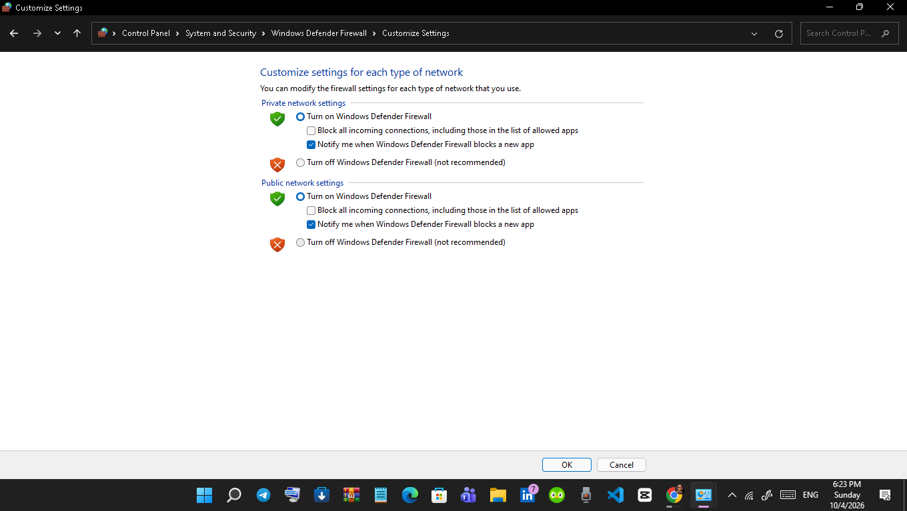
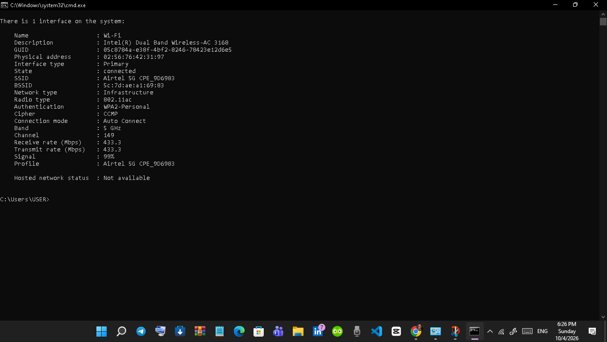
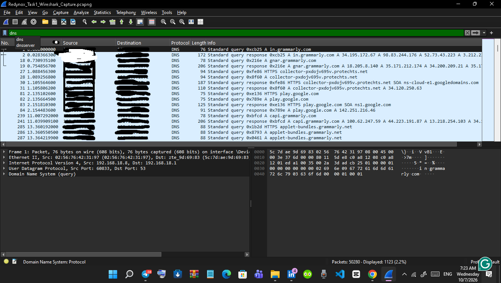
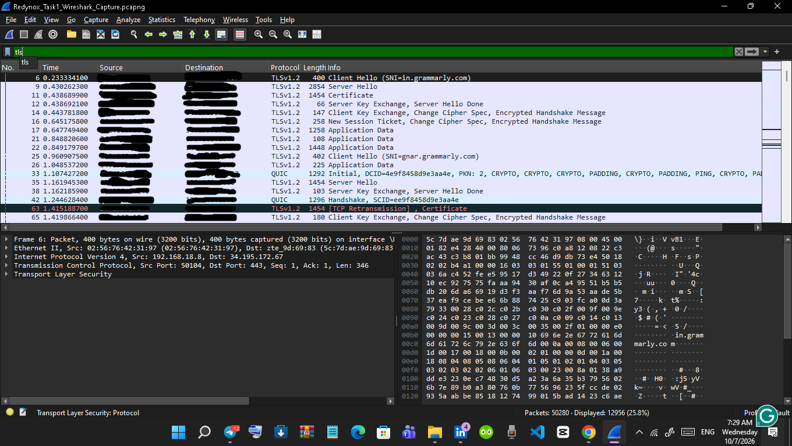

# redynox-cybersecurity-internship-task-1
Hands-on projects from my Redynox Cyber Security Internship, covering network security, Wireshark traffic analysis, firewall configuration, and web application security using OWASP WebGoat and ZAP.

## Task 1: Practical Evidence

The following screenshots document my hands-on work for Task 1 of my Cyber Security Internship at Redynox.

### 1. Windows Defender Firewall

*Figure 1: Windows Defender Firewall enabled for private and public network profiles.*

### 2. Wi-Fi Security

*Figure 2: Wireless connection using WPA2-Personal authentication and CCMP encryption.*

### 3. DNS Traffic Analysis

*Figure 3: DNS queries and responses observed during normal network activity.*

### 4. TLS Traffic Analysis

*Figure 4: TLS handshake messages and encrypted application traffic.*

### 5. TCP Retransmission Analysis

*Figure 5: TCP retransmissions investigated during network traffic analysis.*

### 6. Remote IP Traffic Analysis

*Figure 6: Examination of TCP and TLS traffic involving a remote host.*

### 7. TCP Reset Analysis

*Figure 7: TCP RST and RST/ACK packets examined in Wireshark.*

---

## Internship Report

This report documents my practical work for Task 1 of my Cyber Security Internship at Redynox, including the security configurations, Wireshark traffic analysis, findings, screenshots, and recommendations.

**Intern:** Azorji Perpetual Mmesomachi

[Download the Task 1 Internship Report](report/Redynox_Cyber_Security_Internship_Task_1_Report_Final_Azorji_Perpetual_Mmesomachi.docx)

